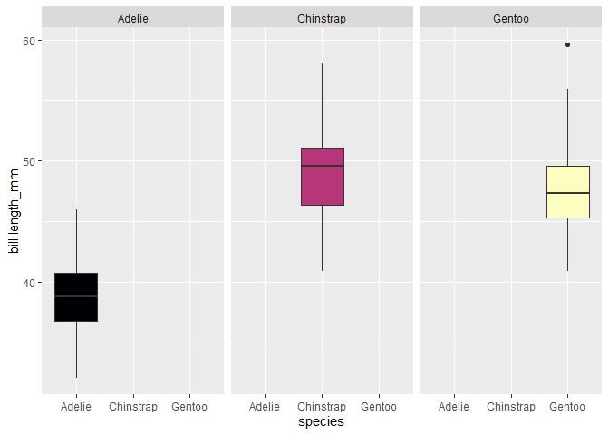
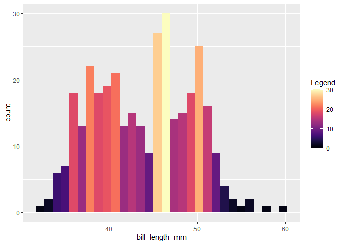

<!-- README.md is generated from README.Rmd. Please edit that file -->

# magmavizR

<!-- badges: start -->

[](https://codecov.io/gh/UBC-MDS/magmavizR?branch=master)

<!-- badges: end -->

Exploratory Data Analysis is one of the key steps in a machine learning
project. This package aims to make this process easy by providing python
functions based on the ‘Altair’ package to plot four common types of
plots with the magma color scheme. To maximize interpretability, the
plots have defined color schemes (discrete, diverging, sequential) based
on the kind of data they show.

## Installation

The development version of the package can be installed from
[GitHub](https://github.com/) with:

``` r
# install.packages("devtools")
devtools::install_github("UBC-MDS/magmavizR")
#> Rcpp      (1.0.7  -> 1.0.8 ) [CRAN]
#> glue      (1.4.2  -> 1.6.1 ) [CRAN]
#> rlang     (0.4.11 -> 1.0.0 ) [CRAN]
#> cli       (3.0.1  -> 3.1.1 ) [CRAN]
#> fansi     (0.5.0  -> 1.0.2 ) [CRAN]
#> tibble    (3.1.5  -> 3.1.6 ) [CRAN]
#> magrittr  (2.0.1  -> 2.0.2 ) [CRAN]
#> stringi   (1.7.5  -> 1.7.6 ) [CRAN]
#> jsonlite  (1.7.2  -> 1.7.3 ) [CRAN]
#> xml2      (1.3.2  -> 1.3.3 ) [CRAN]
#> digest    (0.6.28 -> 0.6.29) [CRAN]
#> yaml      (2.2.1  -> 2.2.2 ) [CRAN]
#> fs        (1.5.0  -> 1.5.2 ) [CRAN]
#> tzdb      (0.1.2  -> 0.2.0 ) [CRAN]
#> backports (1.2.1  -> 1.4.1 ) [CRAN]
#> readr     (2.0.2  -> 2.1.1 ) [CRAN]
#> 
#>   There are binary versions available but the source versions are later:
#>          binary source needs_compilation
#> glue      1.6.0  1.6.1              TRUE
#> rlang    0.4.12  1.0.0              TRUE
#> magrittr  2.0.1  2.0.2              TRUE
#> 
#> package 'Rcpp' successfully unpacked and MD5 sums checked
#> package 'cli' successfully unpacked and MD5 sums checked
#> package 'fansi' successfully unpacked and MD5 sums checked
#> package 'tibble' successfully unpacked and MD5 sums checked
#> package 'stringi' successfully unpacked and MD5 sums checked
#> package 'jsonlite' successfully unpacked and MD5 sums checked
#> package 'xml2' successfully unpacked and MD5 sums checked
#> package 'digest' successfully unpacked and MD5 sums checked
#> package 'yaml' successfully unpacked and MD5 sums checked
#> package 'fs' successfully unpacked and MD5 sums checked
#> package 'tzdb' successfully unpacked and MD5 sums checked
#> package 'backports' successfully unpacked and MD5 sums checked
#> package 'readr' successfully unpacked and MD5 sums checked
#> 
#> The downloaded binary packages are in
#>  C:\Users\ibaad\AppData\Local\Temp\RtmpSyx7p9\downloaded_packages
#>       v  checking for file 'C:\Users\ibaad\AppData\Local\Temp\RtmpSyx7p9\remotes40104b4f4d80\UBC-MDS-magmavizR-377ff54/DESCRIPTION'
#>       -  preparing 'magmavizR':
#>    checking DESCRIPTION meta-information ...     checking DESCRIPTION meta-information ...   v  checking DESCRIPTION meta-information
#>   Warning:     Warning: C:/Users/ibaad/AppData/Local/Temp/RtmpEdf0W3/Rbuild276c4d1f6510/magmavizR/man/histogram.Rd:16: unexpected TEXT '           'distinct', 'max', 'mean', 'median', 'min', 'missing', 'product',
#>    ', expecting ']'
#>       -  checking for LF line-endings in source and make files and shell scripts
#>       -  checking for empty or unneeded directories
#>      Omitted 'LazyData' from DESCRIPTION
#>       -  building 'magmavizR_0.0.0.1.tar.gz'
#>      
#> 
```

## Usage

The magmavizR library can be loaded by using the commands below:

``` r
library("magmavizR")
penguins_data <- palmerpenguins::penguins
```

The four data visualization functions included in the package along with
the usage are outlined below:

### Boxplot

Returns a boxplot based on the data frame, a numerical feature to view
the distribution of and a categorical feature to bucket data into
categories. Additionally, there is a boolean option to facet the
boxplots into separate charts.

``` r
boxplot(penguins_data, species, bill_length_mm, facet = TRUE)
```



### Correlation plot

Returns a correlation plot based on the numerical features present in
the data frame. Additionally, it will print the correlated numerical
feature pairs along with their correlation values.

``` r
corrplot(penguins_data, print_corr = TRUE, title = "Correlation Plot")
```


### Histogram

Returns a histogram based on the data frame and a categorical feature to
plot on the x-axis. The y-axis will display the result of some of the
following aggregating functions:

-   Average

-   Count

-   Distinct

-   Max

-   Min

-   Median

-   Mean

-   Among others (listed in documentation for the function).

``` r
histogram(penguins_data, bill_length_mm, "..count..")
```



### Scatterplot

Returns a scatterplot based on the data frame and two numerical feature
names passed as the required inputs. There are auxiliary inputs that
provide the flexibility to:

-   Color code or change the shape of the data points on a categorical
    variable

-   Set a title to the plot, x-axis, y-axis and color legend

-   Change the opacity and size of the data points

-   Set the scale of the x-axis and y-axis to start from zero

``` r
scatterplot(penguins_data, bill_length_mm, flipper_length_mm, species, "Bill and Flipper length clusters by Species", 0.5, 2.5, "Bill length (mm)", "Flipper length (mm)", "", FALSE, FALSE, TRUE)
```


### Fit within R ecosystem

Our package will build onto the existing features of ‘ggplot’ using the
magma color scheme. It serves as an automated plotter and is a higher
level implementation of it. Essentially it circumvents the need to code
every single detail and allows the user to focus on the output. We came
across two packages on CRAN that have a similar line of thought:

-   \[quickplot\]
    <https://cran.r-project.org/web/packages/quickPlot/index.html> -
    also a high level package based on ggplot that generates plots
    modularly.

-   \[BoutrosLab.plotting.general\]
    (<https://cran.r-project.org/web/packages/BoutrosLab.plotting.general/index.html>) -
    same motivation as this package, plots on a high level with a
    standard format. It does not use ggplot however.

## Contributing

The primary contributors to this package are:

1.  Abdul Moid Mohammed
2.  Mukund Iyer
3.  Irene Yan
4.  Rubén De la Garza Macías

We welcome new ideas and contributions. Please refer to the contributing
guidelines in the CONTRIBUTING.MD file. Do note that this project is
released with a Code of Conduct. By contributing to this project, you
agree to abide by its terms.

## License

`magmavizR` was created by Abdul Moid Mohammed, Mukund Iyer, Irene Yan,
Rubén De la Garza Macías. It is licensed under the terms of the MIT
license.

## Credits

`magmavizR` was created using the tutorial in
[`The Whole Game`](https://r-pkgs.org/whole-game.html).
